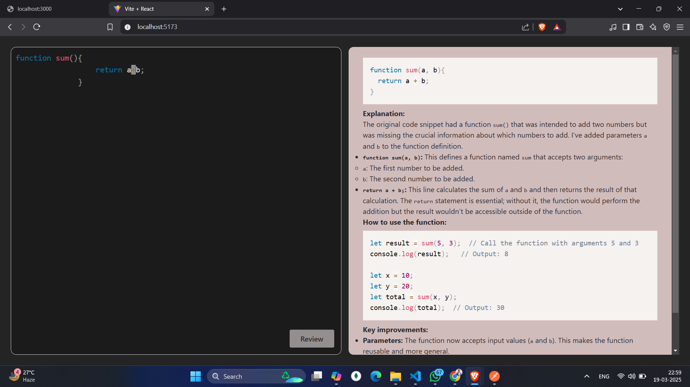

# AI Code Review

AI Code Review is a full-stack web application that allows users to submit any code snippet and receive AI-generated review suggestions and detailed explanations. The backend leverages the Google Gemini API (via the `@google/generative-ai` package) to analyze the input, while the frontend provides an interactive interface for users to paste their code, view suggestions, and learn why changes are recommended.

---

## Features

- **Code Input & Analysis:**  
  Users can input any code snippet to receive feedback.

- **AI-Powered Review & Explanation:**  
  The Gemini API analyzes the code and suggests improvements, along with detailed explanations.

- **Real-Time Interaction:**  
  A smooth and responsive React-based UI delivers a seamless user experience.

- **Modular Architecture:**  
  Separation of concerns between a React frontend (powered by Vite) and an Express/Node.js backend.

---

## Technologies Used

### Frontend
- **React:** For building the dynamic user interface.
- **Vite:** A fast bundler and development server.
- **PrismJS:** For syntax highlighting of code snippets.
- **React Markdown:** For rendering markdown-formatted explanations.
- **React Simple Code Editor:** Lightweight and customizable code editor component.

### Backend
- **Node.js:** JavaScript runtime for building scalable server-side applications.
- **Express:** Simplifies building web APIs and handling HTTP requests.
- **@google/generative-ai:** Provides integration with the Google Gemini API for AI-powered code analysis.
- **dotenv:** For environment variable management.
- **cors:** Enables Cross-Origin Resource Sharing.

---

## Project Structure

ai-code-review/
├── backend/
│   ├── server.js                # Main server file for the backend
│   ├── src/
│   │   ├── controllers/         # API controllers
│   │   ├── services/            # Service logic for AI integration
│   │   └── ...                  # Additional backend modules
│   ├── package.json             # Backend package configuration
│   └── .env                     # Environment variables (e.g., API keys)
│
├── frontend/
│   ├── src/
│   │   ├── App.jsx              # Main React component
│   │   └── ...                  # Additional React components & assets
│   ├── package.json             # Frontend package configuration
│   └── vite.config.js           # Vite configuration file
│
└── README.md                    # Project documentation (this file)
